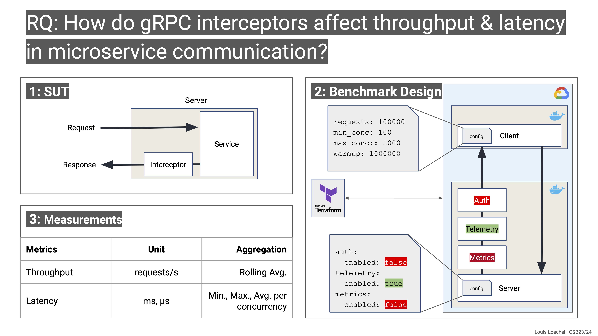

# CloudServiceBenchmarking




## Rodamap
- [X] Set-up simple client-server architecture (containerized)
- [X] add variety of interceptors
- [X] create load generator/benchmarking tool
- [X] GCP setup
- [X] run Benchmarking Experiments
- [X] Analyze results
- [ ] Write report

## Benchmark Configuration
📢 **Important:** The benchmarking experiment takes its configuration from this GitHub Repository. Thus, any changes configured via the ```config.yml``` file in the ```client``` & ```server``` directories need to be pushed in order to be applied in the next experiment run.

### Server
Specify which interceptor to include on the server side by toggling the respective boolean in the ```server/config.yml``` file (for full list, check out the file). 

Example for the Prometheus Metrics Interceptor:
```yml
# Prometheus Metrics Interceptor
metrics:
  enabled: true
```

### Client
Define the load pattern to generate in the ```client/config.yml``` file. In the example below, the client will generate a load of 100.000 requests over 100 iterations each, resulting in 10.000.000 requests throughout the whole experiment. With each iteration the number of concurrent (parallel) requests is increased.
```yml
total_requests: 100000
max_concurrent_requests: 100
min_concurrent_requests: 1
```
#### Warmup
Specify the amount of requests sentto the server before the experiment is prperly started in the ```client/config.yml``` file. In the example below, the client will send 100.000 requests before the experiment is started.
```yml
warmup_requests: 1000000
```


## GCP Setup
### Prerequisites
- [Terraform](https://learn.hashicorp.com/tutorials/terraform/install-cli)
- [GCP Account](https://cloud.google.com/)
- [gcloud CLI](https://cloud.google.com/sdk/docs/install)

### Service Account
Create a service account in GCP and download the JSON key file. Rename it to ```credentials.json``` and place it in an ```/.env``` directory of this repo.

### SSH Key
Create an SSH key pair and place them in the ```/.env``` directory of this repo.

### Terraform
From the ```/tf``` directory of this repo, initialise terraform
```bash
terraform init
```
Then run the terraform script to create the GCP resources
```bash
terraform apply
```
⏳ *optional:* SSH into the (client) VM. You'll find the current result progress in the ```/home/ubuntu/CloudServiceBenchmarking``` directory. Check out the ```result.csv``` file for the current progress. 

🏁 After the Experiment is done, the ```results.csv``` file will be copied to your local machine automatically.

To delete the resources, run
```bash
terraform destroy
```

## Local Setup
### Compile Locally
From the ```/server``` directory of this repo, compile the server binary.
```bash
go build
```


### Build Docker Images
From the top of this repo, build the docker images for server and client.

```bash
docker-compose build
```
### Run containers
Runs the server container first, and then the client container. The client container needs to be run with the `--network="host"` flag to allow it to connect to the server container.
``` bash
docker-compose up
```
🏁 After the Experiment is done, the ```result.csv``` file will be copied to your local machine automatically.

### Bring down containers
```bash
docker-compose down
```
